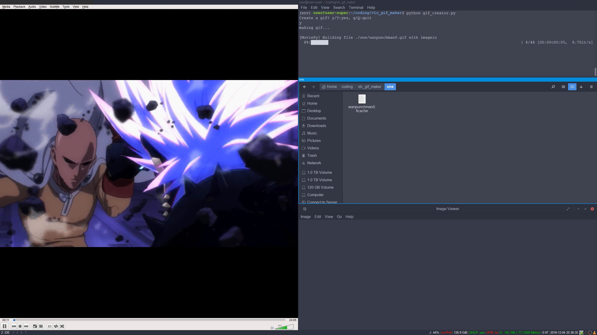
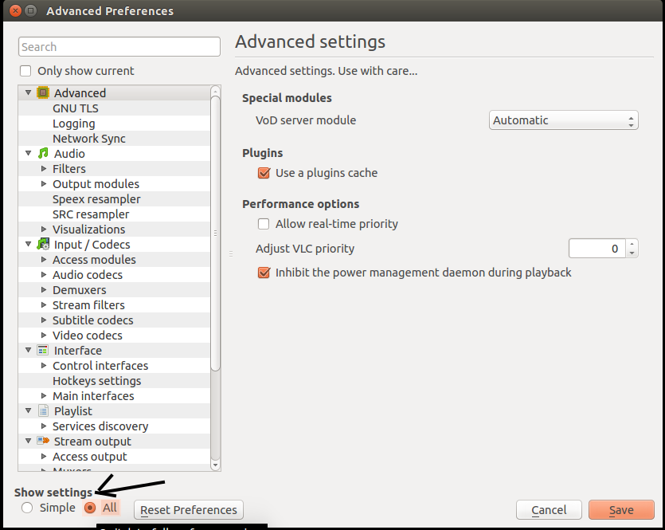
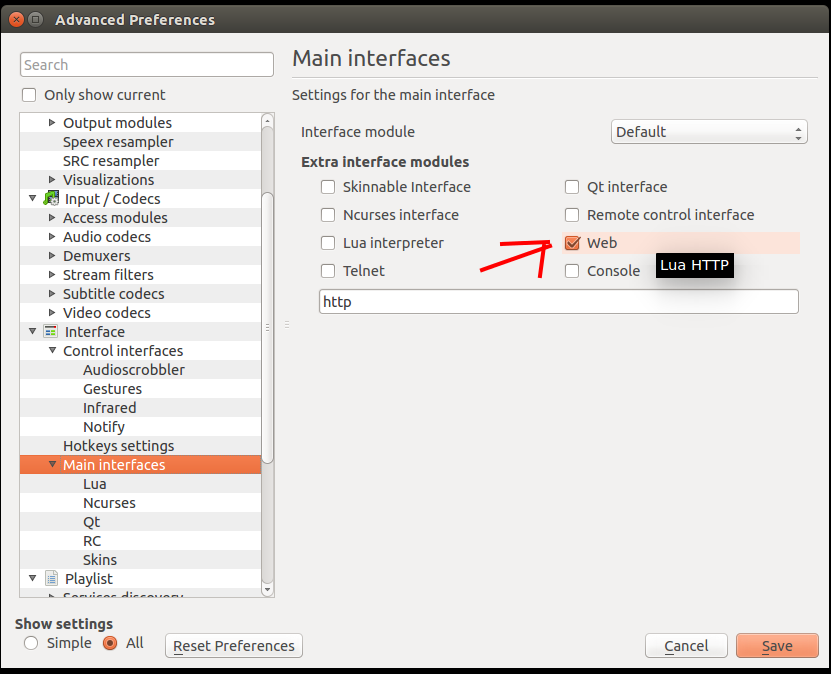
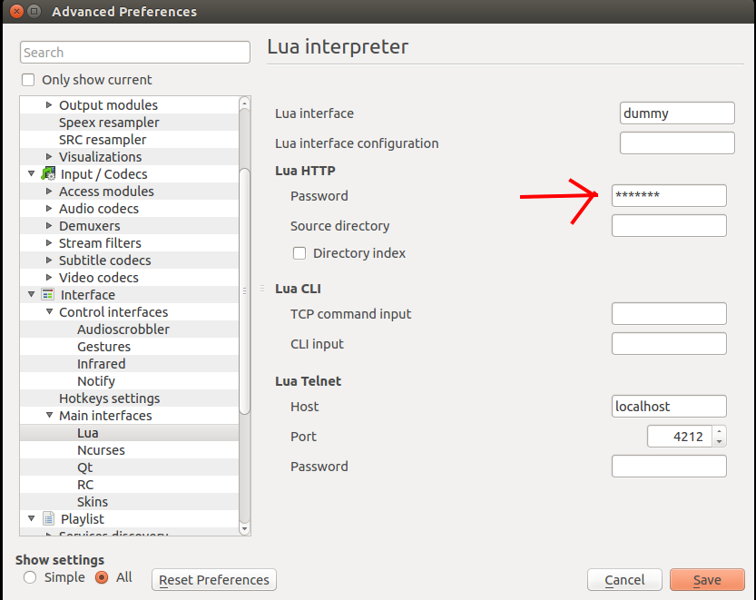

## VLC gif generator
--------------------

### Demo


[Watch the tool in action](https://vimeo.com/221510023)
--------------------




I wrote this tool because I wanted to create gifs quickly and efficiently.
This tool allows you to effortlessly create gifs from VLC. Big shoutout to [moviepy](https://github.com/Zulko/moviepy).
I wouldn't have thought of writing this tool if it was not for that library.

#### How it works
You start by playing a video in VLC. Whenever you see a scene that you like, you hit the action key
which triggers the tool to connect to VLC's http server to grab metadata about the video your currently watching.
The tool then creates a gif of n seconds long starting from where you were in the video.

#### Setup

First off you need to install VLC media player

    http://www.videolan.org/vlc/

Then configure the VLC http server
<br>

###### First click on Tools > Preferences

###### Then click on select all



###### Click on web interface



###### Set a password for the web interface (username not necessary)



##### Once VLC is setup you can begin installing the python package

#### Only tested on linux might also work on MacOS

Make sure you have python3.6+ installed

`sudo pip install git+https://github.com/pydo/vlc-gif-creator.git`

or use a virtualenv

You should now have `gifcreator` available in your $PATH

-------------------------------------------

### Configuration

This tool uses a config file for connecting to VLC's http server and for 
creating the GIFs.
After calling `gifcreator` you will have a this config file `$HOME/.gif_creator.config.ini`
in your home directory.

### Example config file

```
[VLC CREDENTIALS]
user =
password = root123
[VLC SERVER]
status = http://localhost:8080/requests/status.xml
playlist = http://localhost:8080/requests/playlist.xml
[CROPPING]
resize = .70
[GIF]
length = 2
name = gif_name
output_path = ./awesome_gifs
```


###### Note

Not affiliated with VLC in any way.

#### License


